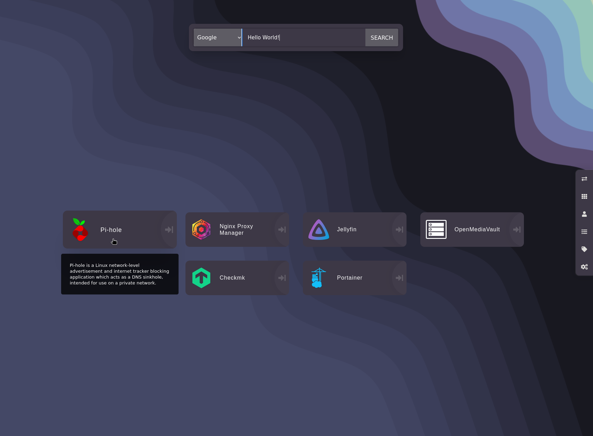
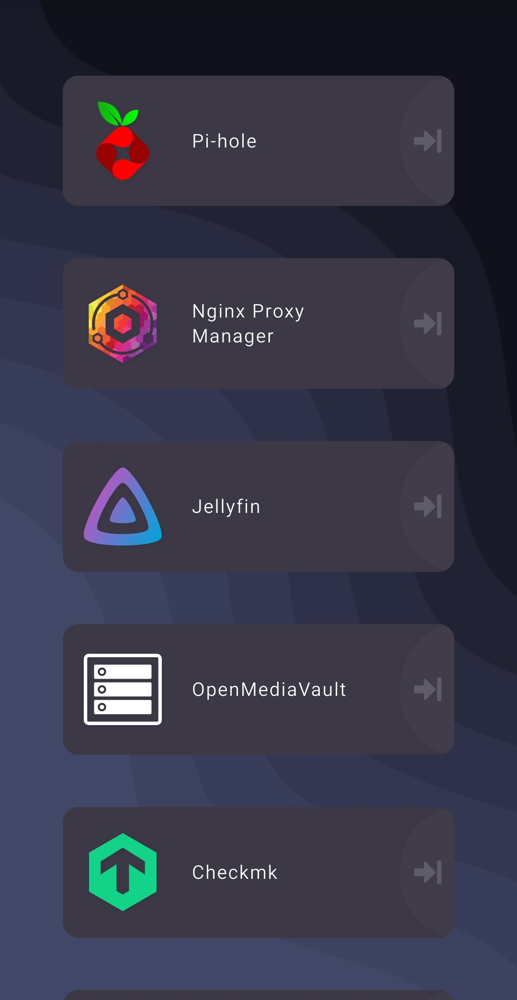
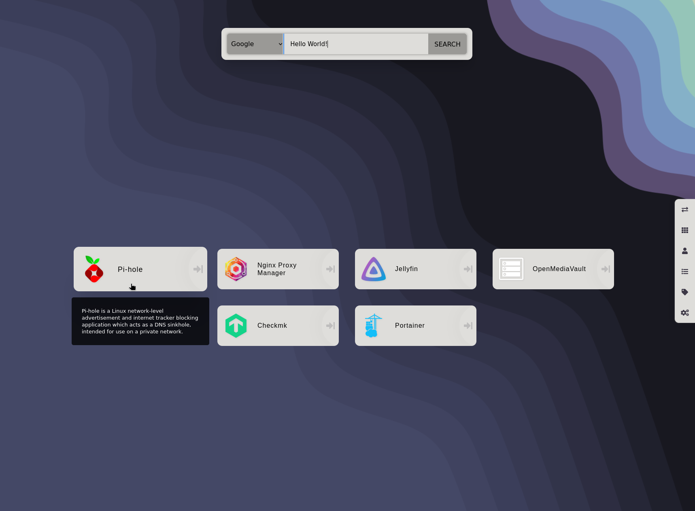
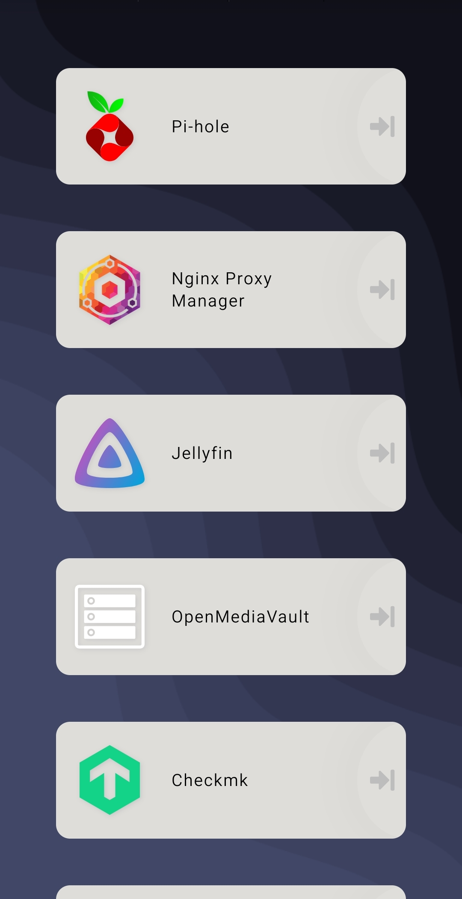

<h3 align="center">
	 
	
	Catppuccin for <a href="https://github.com/linuxserver/Heimdall/">Heimdall</a>
	
</h3>

<h4 align="center">
	Dark mode
</h4>

    
    

<h4 align="center">
	Light mode
</h4>

    
    

# Heimdall Catppuccin Theme

A nice, pastel-colored Catppuccin theme for your Heimdall dashboard.

> The search bar, navigation menu and tooltips are hidden on devices up to a certain size. The size of the bookmark is also not changed when you move the mouse pointer over it (which is not normally possible on a mobile device).

## Installation

1. Copy contents of [style.css](./style.css) file, then paste it into your Heimdall in Settings -> `Custom CSS`.
2. Copy contents of [function.js](./function.js) file, then paste it into your Heimdall in Settings -> `Custom JavaScript`.
3. _(Optional)_ Download [wallpaper.png](./wallpaper.png) file, then set it as your Heimdall background in Settings -> Background Image. Also you can use any other wallpaper as the background that matches catppuccin color palette.
